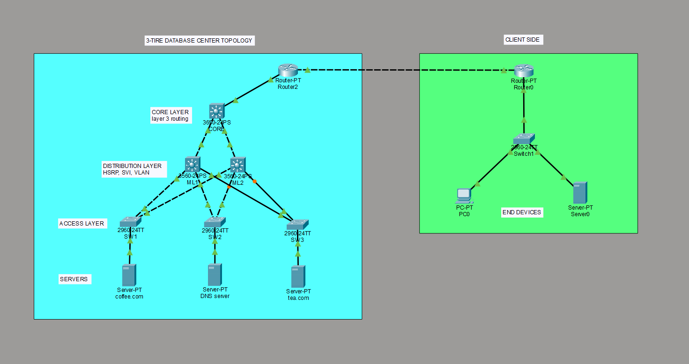

# 3-Tier Data Center Network with HSRP Redundancy

 

A fully functional 3-Tier Data Center built in **Cisco Packet Tracer** featuring VLAN segmentation, HSRP gateway redundancy, STP loop prevention, inter-VLAN routing, DNS, and HTTP web hosting. This project was built as part of my CCNA learning journey.

---

##  Topology



---

##  Architecture

| Layer | Devices | Model | Role |
|-------|---------|-------|------|
| **Core** | CORE-ML0 | 3560-24PS | High-speed Layer 3 routing |
| **Distribution** | DIST-ML1, DIST-ML2 | 3560-24PS | VLAN gateways, HSRP redundancy |
| **Access** | ACC-SW1, SW2, SW3 | 2960-24TT | Server connectivity, VLAN assignment |

---

##  Client Network

| Device | Model | Role |
|--------|-------|------|
| CLIENT-RTR | Router-PT | Client-side router |
| CLIENT-SW | 2960-24TT | Client-side switch |
| PC | PC-PT | End-user workstation |
| Client-Server | Server-PT | Test/validation server |

Client Subnet: `192.168.0.0/24`

---

##  Access Credentials

All devices use the same credentials for console access.

| Credential | Password |
|------------|----------|
| Console Password | `1234` |
| Enable Secret | `3-tier` |

> **Note:** These are lab credentials for learning purposes only.

---

##  Technologies Implemented

| Technology | Purpose |
|------------|---------|
| **VLAN (802.1Q)** | Layer 2 segmentation |
| **STP (PVST)** | Loop prevention with root bridge tuning |
| **PortFast** | Immediate forwarding on server ports |
| **SVI** | Layer 3 VLAN gateways |
| **HSRP** | Virtual gateway redundancy with automatic failover |
| **Static Routing** | Path selection between subnets |
| **DNS** | Domain name resolution |
| **HTTP** | Web hosting services |

---

##  VLAN Design

| VLAN ID | Name | Subnet | Purpose |
|---------|------|--------|---------|
| 10 | SERVERS | 10.10.10.0/24 | coffee.com, DNS Server |
| 20 | BACKUP | 10.20.20.0/24 | tea.com |

---

##  IP Addressing Table

### Data Center Devices

| Device | Interface | IP Address | Subnet Mask |
|--------|-----------|------------|-------------|
| CORE-ML0 | Gig1/0/1 | 10.0.0.1 | 255.255.255.252 |
| CORE-ML0 | Gig1/0/2 | 10.0.0.5 | 255.255.255.252 |
| CORE-ML0 | Gig1/0/3 | 10.0.1.1 | 255.255.255.252 |
| DIST-ML1 | Gig0/1 | 10.0.0.2 | 255.255.255.252 |
| DIST-ML2 | Gig0/1 | 10.0.0.6 | 255.255.255.252 |
| DIST-ML1 | VLAN 10 | 10.10.10.2 | 255.255.255.0 |
| DIST-ML1 | VLAN 20 | 10.20.20.2 | 255.255.255.0 |
| DIST-ML2 | VLAN 10 | 10.10.10.3 | 255.255.255.0 |
| DIST-ML2 | VLAN 20 | 10.20.20.3 | 255.255.255.0 |

### HSRP Virtual IPs

| VLAN | Virtual IP | Active Router | Standby Router |
|------|------------|---------------|----------------|
| 10 | 10.10.10.1 | DIST-ML1 (Pri 110) | DIST-ML2 (Pri 90) |
| 20 | 10.20.20.1 | DIST-ML1 (Pri 110) | DIST-ML2 (Pri 90) |

### Edge & Client Devices

| Device | Interface | IP Address | Subnet Mask |
|--------|-----------|------------|-------------|
| EDGE-RTR | Fa0/0 | 10.0.1.2 | 255.255.255.252 |
| EDGE-RTR | Fa1/0 | 10.0.100.2 | 255.255.255.0 |
| CLIENT-RTR | Fa0/0 | 10.0.100.1 | 255.255.255.0 |
| CLIENT-RTR | Fa0/1 | 192.168.0.1 | 255.255.255.0 |

### Servers

| Server | VLAN | IP Address | Gateway | Service |
|--------|------|------------|---------|---------|
| Server1 | 10 | 10.10.10.10 | 10.10.10.1 | HTTP (coffee.com) |
| Server2 | 10 | 10.10.10.11 | 10.10.10.1 | DNS |
| Server3 | 20 | 10.20.20.10 | 10.20.20.1 | HTTP (tea.com) |

---

##  HSRP Configuration

```cisco
! DIST-ML1 (Active)
interface vlan 10
  standby 10 ip 10.10.10.1
  standby 10 priority 110
  standby 10 preempt

interface vlan 20
  standby 20 ip 10.20.20.1
  standby 20 priority 110
  standby 20 preempt

! DIST-ML2 (Standby)
interface vlan 10
  standby 10 ip 10.10.10.1
  standby 10 priority 90

interface vlan 20
  standby 20 ip 10.20.20.1
  standby 20 priority 90


✅ Failover Test Results
Test	Action	Result
Gateway Failover	Shut VLAN 10 on DIST-ML1	✅ DIST-ML2 became Active
Ping Continuity	Continuous ping during failover	✅ 0% packet loss
Preempt	Restore DIST-ML1 VLAN 10	✅ ML1 resumed Active role
Trunk Failover	Shut Fa0/2 on DIST-ML1	✅ STP unblocked backup path


🌍 Services
Service	Server	Domain	IP
HTTP	Server1	coffee.com	10.10.10.10
HTTP	Server3	tea.com	10.20.20.10
DNS	Server2	—	10.10.10.11
DNS Records
Domain	Type	IP Address
coffee.com	A	10.10.10.10
tea.com	A	10.20.20.10


How to Use

Download 3tier-datacenter.pkt

Open in Cisco Packet Tracer 8.0 or later

All devices are pre-configured — no setup needed

Test Web Access
Open Client-Server → Desktop → Web Browser

Browse:

http://coffee.com

http://tea.com

http://10.10.10.10

http://10.20.20.10

Test HSRP Failover
Open Server1 → Desktop → Command Prompt

Run: ping 10.10.10.1

On DIST-ML1 CLI:

text
enable
configure terminal
interface vlan 10
shutdown
Observe ping continues with 0% packet loss

Restore: no shutdown

⚠️ Important: First-Time Ping Behavior
Due to ARP table learning, the first ping from Client → Server may fail. This is normal Ethernet behavior — switches need to learn MAC addresses before forwarding.

Workaround: Prime the ARP Tables
Run this ping path first to populate ARP tables across all switches:

text
From Server1, ping the entire path to the client:

ping 10.10.10.1        (HSRP Virtual Gateway)
ping 10.0.0.1          (CORE-ML0)
ping 10.0.1.2          (EDGE-RTR)
ping 10.0.100.2        (EDGE-RTR client side)
ping 10.0.100.1        (CLIENT-RTR)
ping 192.168.0.10      (Client-Server)
After this, pings from Client → Server will work immediately.

This is not a bug. In production networks, constant traffic keeps ARP tables populated automatically.

📁 File Structure
text
3-tier-datacenter/
├── 3tier-datacenter.pkt
├── README.md
├── topology.png
└── configs/
    ├── CORE-ML0.txt
    ├── DIST-ML1.txt
    ├── DIST-ML2.txt
    ├── ACC-SW1.txt
    ├── ACC-SW2.txt
    ├── ACC-SW3.txt
    ├── EDGE-RTR.txt
    └── CLIENT-RTR.txt
📝 Key Learnings
VLAN segmentation and 802.1Q trunking

HSRP configuration and real failover testing

STP root bridge tuning and PortFast

Inter-VLAN routing using SVIs

Static route configuration across multiple hops

DNS and HTTP service deployment

Network troubleshooting (ARP, MAC tables, routing tables)

Professional network documentation


🔮 Future Improvements
Replace static routes with OSPF

Add ACLs for security between VLANs

Implement DHCP for client network

Add Syslog server for logging

Configure SNMP for network monitoring


Author
Jithin Jose

🎓 BSc Cyber Security & Forensics

📍 Kollam, Kerala, India

🔗 LinkedIn: https://www.linkedin.com/in/jithin-v-jose/

   GitHub: https://github.com/jithinVjose007 


